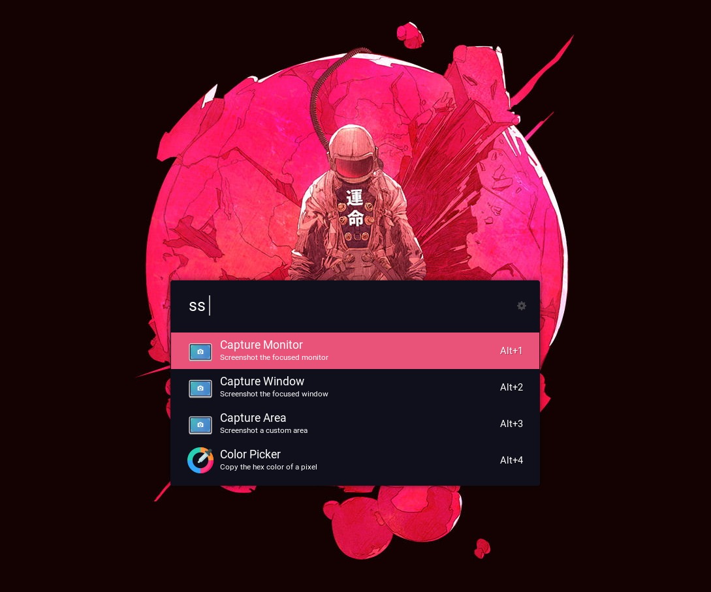

# Overview



A [Ulauncher](https://github.com/Ulauncher/Ulauncher) extension to take screenshots for [SwayWM](https://github.com/swaywm/sway).
It also includes a color picker! 

# Requirements
- `notify-send`: Screenshot notifications
- [`grim`](https://github.com/emersion/grim): Wayland screenshots
- [`slurp`](https://github.com/emersion/slurp): Region selector

# Installation
Copy this extension into the Ulauncher extensions folder.
```bash
mkdir -p ~/.local/share/ulauncher/extensions
git clone https://github.com/Hermitter/ulauncher-wayshot ~/.local/share/ulauncher/extensions/wayshot
```

Stop Ulauncher
```
sudo pkill ulauncher
```

Start Ulauncher
```
ulauncher
```

# Issues
- Notifications are sent even if the screenshot is cancelled
- Capture Monitor doesn't always work
